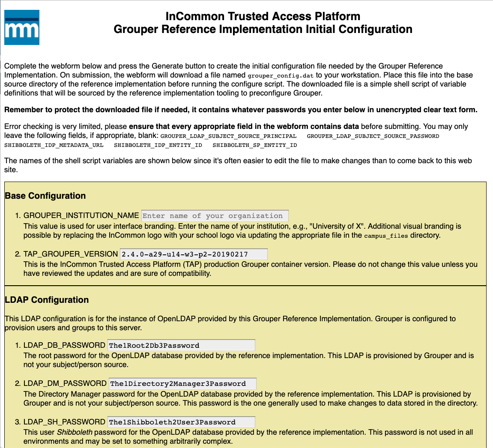

### Introduction

This [Grouper](https://www.internet2.edu/grouper/) InCommon Trusted Access
Platform (TAP) Reference Implementation automates the use case of running
Grouper to manage a LDAP directory leveraging an existing campus LDAP
directory or Active Directory as the source of campus People (Subjects).  The
provided LDAP directory is initially empty and is automatically populated with
users and groups via interaction with the Grouper User Interface and through
Grouper's Loader and Web Services.  The contents of the provided LDAP
directory can be examined using your favorite LDAP search tools.

The scripting and web configuration tools are built so that this Reference
Implementation can be installed on your laptop, configuring Grouper to use
simple password-based authentication, or run on a server fully integrated into
your campus Shibboleth environment.

This Reference Implementation (RI) operates in a Docker Swarm environment and
provides containers for OpenLDAP, a MARIADB database for Grouper, and
individual containers for several Grouper roles (UI, loader, web services,
etc.).  The Reference Implementation supports authentication to the Grouper UI
both using simple passwords (ideal for testing on your laptop) and via a
Shibboleth SP (perfect for use by multiple people on a server).  The build's
scripting is designed to work on Linux and MacOS.

This implementation is not meant to be deployed directly into production.  In particular, a
real database with backups and all of the normal infrastructure is needed.
This code is useful as a working template for designing your
production implementation as well as early learning and working with Grouper
itself.

### Installation
1. Ensure that your docker environment has Docker Swarm enabled.
	  * `docker swarm init | tee swarm_init.txt`
	  * `chmod 400 swarm_init.txt`

	  You don't need multiple nodes in the swarm.  In fact, the scripting assumes that you do not have multiple swarm nodes (no registry is provided). The reference implementation relies on Docker Secrets and operates on a single-node swarm environment.

2. Initial Code Acquisition
	  * If you are using the tarball distribution, extract it into an empty directory and then `cd into grouper`.  We call this directory _HOME_.  If you are reading this text on your machine, you already have a distribution in place.
	  * To instead obtain a copy from github, `git clone https://github.com/jajokl/grouper-ref-impl` and `cd into grouper-ref-impl`.  This will now be the _HOME_ directory.

2. Build and run the web-based grouper RI configuration utility
	  * `cd grouper_cfg`
	    * `./build.sh`
	    * `./start-cfg.sh`
	    * browse to: http://localhost/ (or the URL of your docker host) and fill in the web form
          * Select local password authentication or Shibboleth depending on your needs. 
	      * Press the Submit button and download the file `grouper_config.dat`
	      * Place this downloaded config file into HOME
	    * `./stop-cfg`
        * `cd HOME`

2. Add campus-specific files - this step is *optional* if you selected password-based authentication
	  * `cd campus_data`
	  * If you enabled Shibboleth-based Grouper authentication in the web configuration tool, you __must__ copy the needed certificates and keys  into this directory.  The needed files are: `cachain.pem`, `server_ssl.crt`, `server_ssl.key`, `shib_sp-cert.pem`, and `shib_sp-key.pem`.
	  * You __may__ also add your IdP metadata to `HOME/campus_metadata` using the filename `idp-metadata.xml` instead of having the setup scripts download the metadata for you via the webform URL.
	  * Some find it helpful to first bring a simple Apache-based Shibboleth SP on-line, configure it with the appropriate metadata, and test before completing these steps.
	  * _Optionally_, you can replace the InCommon `school_logo.png` and `favicon.ico` files with appropriate campus images.

2. Generate the needed containers and start the application
	  * `cd HOME`
	  * `./setup_grouper.sh`
	  * `./build.sh`
	  * `./startup.sh`

2. Wait a couple/few minutes

   The startup process takes approximately a minute on a fast laptop with flash
   storage.  Startup will take significantly longer when run on a machine with spinning storage media.  You can watch the grouper_ui container logs to see when Grouper is
   ready for use.  This container does the database preparation/check work on
   startup and other services wait for the UI to be on-line before starting.

2. Login to the Grouper User Interface
	  * https://localhost/grouper/, http://localhost/grouper, or the equivalent URL for your docker host.  Use the admin credentials you entered into the webform (password or Shibboleth)
	  * If unsure of what to do next, see: https://spaces.at.internet2.edu/display/Grouper/Grouper+new+UI
	  * The Grouper Loader `etc:pspng:provision_to` attribute values configured in the Reference Implementation are: `psp_groupOfNames`, `pspng_entitlements`, `pspng_membership`.  See the Grouper Loader documentation for more information: https://spaces.at.internet2.edu/display/Grouper/Grouper+Provisioning:+PSPNG
	  * You can view the changes Grouper provisions to the provided OpenLDAP via the following commands.  Replace `localhost` below if running on a server.
	    * `ldapsearch -x -h localhost -b ou=People,dc=myschool,dc=edu '(uid=*)'`
	    * `ldapsearch -x -h localhost -b ou=Groups,dc=myschool,dc=edu '(cn=*groupname*)'`

2. When done
	  * `./shutdown.sh` or `docker stack rm grouperRI`

2. Restarting the Reference Implementation
	  * To restart the service where you left off (i.e., retaining your grouper and ldap databases), just run `./startup.sh`
	  * In order to obtain a new clean database for testing, wait for two or three minutes after
	step 12, then run `docker volume prune` (follow with a `docker volume ls` to make
	sure they are gone).  __If you have other docker volumes that you need to preserve for other applications,__ explicitly delete the volumes named `grouperRI_grouper_ldap`,
    `grouperRI_grouper_ldap_etc`, and `grouperRI_grouper_mysql` instead.
	`docker volume prune` will **delete all docker volumes on your machine**.

2. Clean Restart

You should not need a clean restart, but if
 you are running into weird issues after multiple attempts to use the reference
 implementation, it may be time to clean up all of the docker components and start
 fresh.  The instructions below will remove most docker application components on
 your machine.  If you are running other docker services on the machine, **you
 will NOT** want to follow these instructions directly and will want to make sure
 that you preserve what is needed on your machine.
	  * `docker stack rm grouperRI; sleep 120`
	  * `docker rm $(docker ps -a)` # just in case something hasn't completed
	  * `docker ps -a` # if you see anything, repeat the step above
	  * `yes | docker volume prune`
	  * `docker rmi $(docker image ls -aq)`

### Troubleshooting, Known Issues and Discussion
1. If you are unable to access the Grouper UI via your web browser, make sure that you ran `./stop-cfg.sh` to stop the web configuration container.
2. Cleanup work remains for some of the configuration files.
2. The configuration web container should be modified so that it can also assist with Shibboleth debugging of the server version of the reference implementation.
2. The provided `docker-compose.yml` file mounts secrets on invocation from the secret's tree.  A production Swarm-based Grouper 
	environment will most likely create the secrets via a separate, more protected, process.  The needed secret statements are commented out in the provided `docker-compose.yml` file.
2. A partial view of Web Configuration Page of Step 3 is below.  Click here for [a complete example](./Grouper-RI-example.html) of the config web form.

